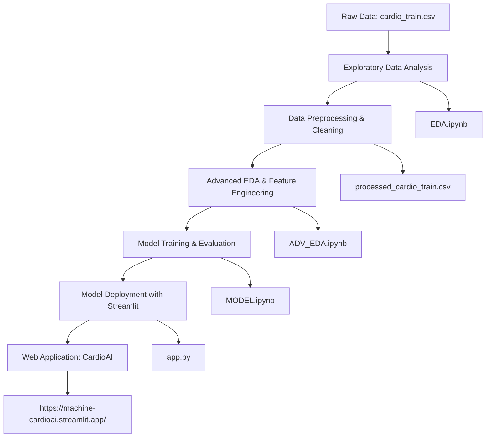

# CardioAI: Advanced Cardiovascular Risk Prediction System

[](https://machine-cardioai.streamlit.app/)

An intelligent machine learning system for predicting cardiovascular disease risk using patient health metrics. Built with Python, scikit-learn, and deployed on Streamlit.

## 📋 Table of Contents
- [Overview](#overview)
- [Project Workflow](#project-workflow)
- [Files Description](#files-description)
- [Installation](#installation)
- [Usage](#usage)
- [Model Details](#model-details)
- [Deployment](#deployment)
- [Contributing](#contributing)

## 🎯 Overview

CardioAI analyzes patient data including age, gender, blood pressure, cholesterol levels, BMI, and lifestyle factors to predict cardiovascular disease risk. The system provides an easy-to-use web interface for healthcare professionals and individuals to assess heart health risks.

**Key Features:**
- Real-time risk prediction
- Interactive web dashboard
- Feature engineering for accurate predictions
- Comprehensive data analysis and visualization

## 🔄 Project Workflow

The project follows a systematic machine learning pipeline:



### Detailed Workflow Steps:

1. **Data Collection**: Obtain cardiovascular health dataset (`cardio_train.csv`)
2. **Initial EDA**: Analyze data distribution, identify outliers, and understand feature relationships (`EDA.ipynb`)
3. **Data Preprocessing**: Clean data, handle missing values, remove impossible values, create processed dataset (`processed_cardio_train.csv`)
4. **Advanced Analysis**: Deep dive into feature engineering, correlation analysis, and statistical insights (`ADV_EDA.ipynb`)
5. **Model Development**: Train machine learning models, perform hyperparameter tuning, evaluate performance (`MODEL.ipynb`)
6. **Web Deployment**: Build interactive Streamlit application for real-time predictions (`app.py`)

## 📁 Files Description

### Core Files
- **`app.py`**: Main Streamlit application file containing the web interface, input preprocessing, and prediction logic
- **`requirements.txt`**: Python dependencies required to run the application
- **`style.css`**: Custom CSS styling for the Streamlit app interface

### Data Files
- **`cardio_train.csv`**: Raw cardiovascular health dataset (semicolon-separated)
- **`processed_cardio_train.csv`**: Cleaned and preprocessed dataset ready for modeling

### Analysis Notebooks
- **`EDA.ipynb`**: Initial Exploratory Data Analysis notebook
  - Data loading and basic statistics
  - Outlier detection and removal
  - Basic visualizations
  - Data cleaning and preprocessing

- **`ADV_EDA.ipynb`**: Advanced Exploratory Data Analysis notebook
  - In-depth feature analysis
  - Correlation studies
  - Advanced visualizations
  - Feature engineering insights

- **`MODEL.ipynb`**: Machine Learning Model Development notebook
  - Model training and evaluation
  - Hyperparameter tuning
  - Performance metrics
  - Model serialization (saves `model.pkl`)

### Environment & Cache
- **`mlenv/`**: Python virtual environment directory
- **`__pycache__/`**: Python bytecode cache directory

## 🚀 Installation

### Prerequisites
- Python 3.8 or higher
- pip package manager

### Setup Instructions

1. **Clone the repository:**
   ```bash
   git clone <repository-url>
   cd ml_project_cardio
   ```

2. **Create virtual environment:**
   ```bash
   python -m venv mlenv
   ```

3. **Activate virtual environment:**
   - Windows: `mlenv\Scripts\activate`
   - Linux/Mac: `source mlenv/bin/activate`

4. **Install dependencies:**
   ```bash
   pip install -r requirements.txt
   ```

## 💻 Usage

### Running the Application Locally

1. Ensure the virtual environment is activated
2. Run the Streamlit app:
   ```bash
   streamlit run app.py
   ```
3. Open your browser to `http://localhost:8501`

### Using the Web Application

1. Access the deployed app: [https://machine-cardioai.streamlit.app/](https://machine-cardioai.streamlit.app/)
2. Enter patient information:
   - Age (years)
   - Gender
   - Height (cm) and Weight (kg)
   - Systolic/Diastolic Blood Pressure
   - Cholesterol and Glucose levels
   - Lifestyle factors (smoking, alcohol, physical activity)
3. Click "Predict Risk" to get cardiovascular risk assessment

## 🧠 Model Details

### Features Used
- **Demographics**: Age, Gender
- **Physical**: Height, Weight, BMI
- **Vital Signs**: Systolic BP, Diastolic BP, Blood Pressure Difference
- **Biochemical**: Cholesterol, Glucose
- **Lifestyle**: Smoking, Alcohol consumption, Physical activity
- **Engineered Features**: Age × Systolic BP interaction

### Model Architecture
- **Algorithm**: Ensemble methods (likely Random Forest or Gradient Boosting)
- **Training Data**: Processed cardiovascular health dataset
- **Evaluation Metrics**: Accuracy, Precision, Recall, F1-Score, ROC-AUC

### Prediction Output
- **Binary Classification**: Risk (1) or No Risk (0)
- **Risk Assessment**: High/Medium/Low risk categories based on probability thresholds

## 🌐 Deployment

The application is deployed on Streamlit Cloud for public access. The deployment process includes:

1. Model serialization (`model.pkl`)
2. Streamlit app configuration
3. CSS styling integration
4. Cloud deployment with persistent model loading

**Live Demo**: [https://machine-cardioai.streamlit.app/](https://machine-cardioai.streamlit.app/)

## 🤝 Contributing

Contributions are welcome! Please follow these steps:

1. Fork the repository
2. Create a feature branch (`git checkout -b feature/AmazingFeature`)
3. Commit your changes (`git commit -m 'Add some AmazingFeature'`)
4. Push to the branch (`git push origin feature/AmazingFeature`)
5. Open a Pull Request

### Development Guidelines
- Follow PEP 8 style guidelines
- Add docstrings to functions
- Update requirements.txt for new dependencies
- Test changes locally before submitting

## 📞 Contact

For questions or feedback about CardioAI, please open an issue in this repository.

---

**Built with ❤️ for better cardiovascular health assessment**
